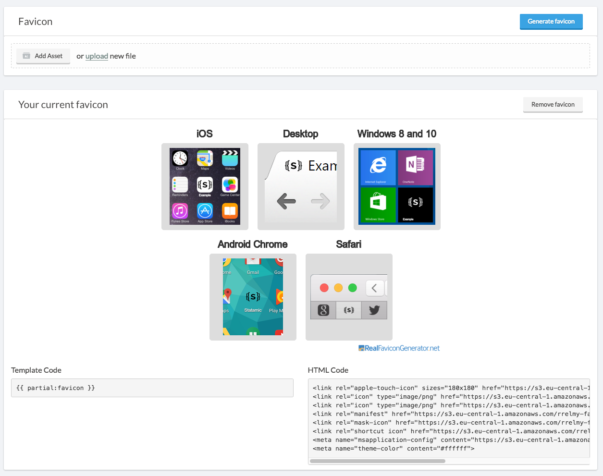

# Favicon Generator for Statamic 

[](https://styleci.io/repos/82310063)
[](https://scrutinizer-ci.com/g/subpixel-ch/statamic-favicon/?branch=master)
[](https://scrutinizer-ci.com/g/subpixel-ch/statamic-favicon/build-status/master)
[](https://insight.sensiolabs.com/projects/226e583a-ef44-46b4-ab09-298ef6804e8b)

> Statamic 2.1 is no longer supported! Check the separate 2.1 tag if you really want to try it. 

Easy way to get state of the art icons for your website.



## Installation
1. Copy `Favicon` into the `site/addons` folder.
2. Get a API key at [Real Favicon Generator](https://realfavicongenerator.net/api/#register_key)
3. Configure the settings of the Favicon addon

## Settings
| Name               | Description                                                              |
| ------------------ | ------------------------------------------------------------------------ |
| `API Key`          | Your personal API key                                                    |
| `Partial`          | Name of the partial the HTML code will be stored in                      |
| `Assets container` | Choose your container                                                    |
| `Asset folder`     | Folder where the images are stored, DO NOT use the root of the container |

### WARNING
Do not set the Partial name to a already existing partial! It will be overwritten!

The asset folder will be deleted completely before saving the new icons, do not upload any other files into it!

## Usage
Just choose your image and proceed.

You only need to add the partial (name can be changed in the settings) to your template

```
{{ partial:favicon }}
```

## FAQ

### Do I have to upload my base image to statamic?
No, you can start the favicon generator without choosing a asset inside statamic.
Just click the "Generate favicon" button and you can upload your image on Real Favicon Generator without storing it in Statamic

### Can I edit the partial
You should not.
At every favicon generation the partial will be overwritten with the new code!

### Does it work with Amazon S3 asset containers?
Yes, it does.

### Can I safely remove the addon after the icon is generated?
Yes, all  the files are stored as Assets inside statamic. The HTML code is inside a partial.

You only need the addon if you plan to update your favicon.

### Do I really need the API key?
Yes, Real Favicon Generator is a free service, the statamic integration requires a API key.

[Get your API key](https://realfavicongenerator.net/api/#register_key)
